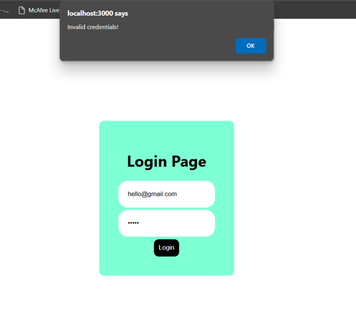
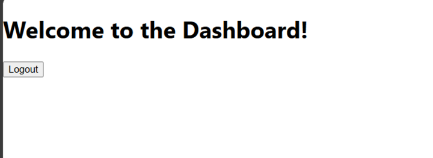

# Login Authentication React App

## Description

This is a simple React application with login authentication. The app consists of:
- A **Login Page** where users can enter their credentials.
- A **Dashboard** that is accessible only upon successful authentication.
- A **Logout Button** on the dashboard to end the session and return to the login page.

## Features
- **Authentication**: Users can log in with valid credentials.
- **Protected Routes**: The dashboard is accessible only to authenticated users.
- **Logout Functionality**: Ends the session and redirects back to the login page.

---

## Screenshots

### Login Page

### Dashboard

